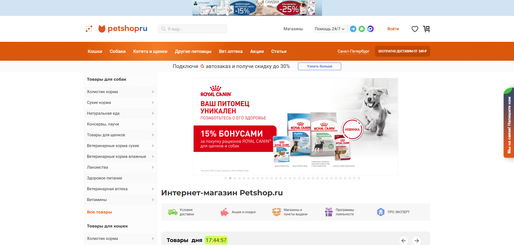
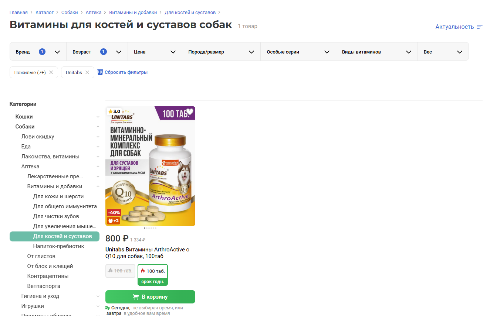
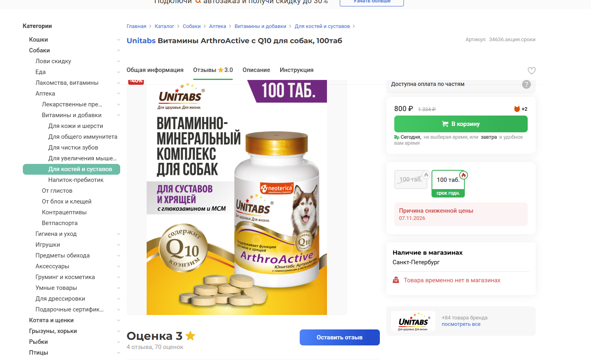
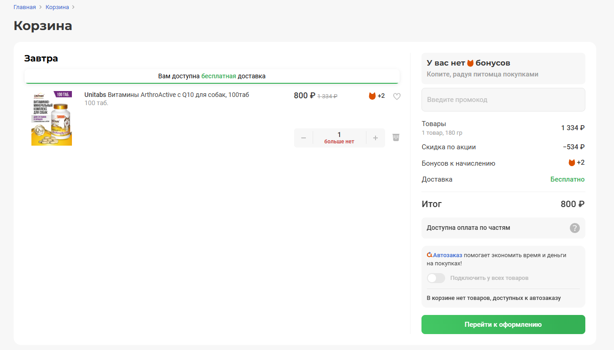
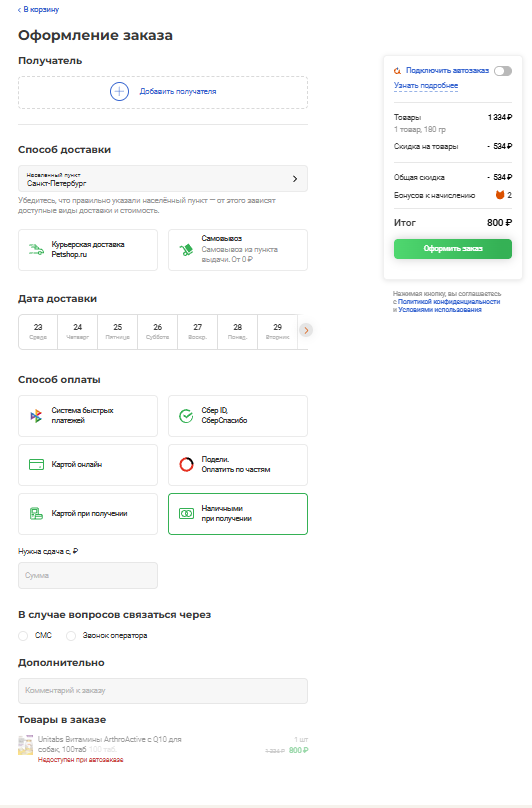

# Web UI Autotests Project — Petshop

Automated UI tests for a pet shop web application using Python, Selenium and Pytest.
The project was created as part of practical QA automation training and demonstrates a Page Object Model (POM) approach for organizing UI tests, reusable page methods, test data and common Selenium actions.

---

## Project overview
The test project covers the main user flow of the pet shop:

```text
Login
  ↓
Open catalog
  ↓
Filter products
  ↓
Open product card
  ↓
Add product to cart
  ↓
Open cart
  ↓
Proceed to checkout
  ↓
Fill order information
  ↓
Select notification method
  ↓
Submit order
```
The tests are focused on the critical user scenario from product selection to checkout.

---

## Covered functionality

### Authentication
- Open the login page
- Enter user credentials
- Log in to the application
- Verify successful authentication

### Product catalog
- Open the product catalog
- Select the vitamins category
- Apply product filters
- Filter products by brand
- Filter products by target age
- Verify that the expected products are displayed

### Product card
- Open the selected product
- Verify the product name
- Verify the product brand
- Verify product information
- Add the product to the cart

### Shopping cart
- Open the shopping cart
- Verify the selected product
- Verify the product price
- Proceed to checkout

### Checkout
- Enter or change the required order information
- Add an order comment
- Select SMS notification
- Submit the order
- Verify the final order information

---

## Project structure
```text
stepikEducationPetshop/
│
├── docs/
│   └── screenshots/
│       ├── main_page.png
│       ├── product_catalog.png
│       ├── product_card.png
│       ├── cart.png
│       └── checkout.png
│
├── pages/
│   ├── base.py
│   ├── login_page.py
│   ├── menu_page.py
│   ├── card_page.py
│   ├── cart_page.py
│   └── finish_page.py
│
├── tests/
│   └── ...
│
├── conftest.py
├── requirements.txt
├── .gitignore
└── README.md
```
### `docs/screenshots`
Contains screenshots illustrating the main pages and stages of the automated test scenario.

### `pages`
Contains Page Object classes.
Each page object contains:
- page locators;
- methods for interacting with page elements;
- reusable checks;
- common actions related to the corresponding page.

### `pages/base.py`
Contains common Selenium methods used by different pages, including:
- getting the current URL;
- URL validation;
- getting screenshots;
- closing popups;
- closing cookie notifications;
- checking element values;
- checking phone information.

### `pages/login_page.py`
Contains methods and locators related to authentication.

### `pages/menu_page.py`
Contains methods for working with the product catalog and filters.
The current scenario uses the vitamins category and product filters.

### `pages/card_page.py`
Contains methods for working with the selected product card.

### `pages/cart_page.py`
Contains methods for working with the shopping cart.

### `pages/finish_page.py`
Contains methods for working with the checkout page and order submission.

---

## Page Object Model
The project uses the Page Object Model pattern.
The main idea is to separate:
- test scenarios;
- page locators;
- page interaction methods.
This makes the tests easier to read and allows common page actions to be reused in different tests.
The general structure is:

```text
Test
 ↓
Page Object
 ↓
Selenium WebDriver
 ↓
Web application
```

---

## Tech stack

- Python
- Selenium WebDriver
- Pytest
- Page Object Model
- Chrome WebDriver
- PyCharm
- Git / GitHub

---

## Installation

### 1. Clone the repository

```bash
git clone https://github.com/AlexanderOsipkin/stepikEducationPetshop.git
cd stepikEducationPetshop
```

### 2. Create a virtual environment

```bash
python -m venv .venv
```
Activate the virtual environment.

#### Windows

```powershell
.venv\Scripts\activate
```

#### macOS / Linux

```bash
source .venv/bin/activate
```

### 3. Install dependencies

```bash
pip install -r requirements.txt
```

---

## Test configuration
The browser is configured through the Pytest fixture in `conftest.py`.
The project uses Chrome WebDriver.
The application base URL is configured through the WebDriver fixture and is used by the Page Object classes instead of duplicating the URL in every page.

---

## Run tests
Run all tests:
```bash
pytest -sv
```
The `-s` option allows `print()` output to be displayed in the console.
Run a specific test file:
```bash
pytest -sv tests/test_....py
```
Run a specific test:
```bash
pytest -sv tests/test_....py::TestClass::test_name
```
---

## Test scenario
The main automated scenario is based on the following user journey:
1. Log in to the application.
2. Open the product catalog.
3. Select the vitamins category.
4. Apply the required product filters.
5. Open the selected product card.
6. Verify product information.
7. Add the product to the cart.
8. Open the cart.
9. Proceed to checkout.
10. Fill in the required checkout information.
11. Add an order comment.
12. Select SMS notification.
13. Submit the order.
14. Verify the final order information.
---

## Screenshots
The repository contains screenshots of the main stages of the tested user flow.

### Main page
Screenshot of the main page of the pet shop website.


### Product catalog
Screenshot of the product catalog with the required filters applied.


### Product card
Screenshot of the selected product card.


### Shopping cart
Screenshot of the shopping cart with the selected product.


### Checkout page
Screenshot of the checkout page with the entered order information.


---

## Test flow

```text
LoginPage
    ↓
MenuPage
    ↓
CardPage
    ↓
CartPage
    ↓
FinishPage
```
Each page is responsible for its own locators and interactions, while the test contains the business scenario.

---
## Locator approach
The project uses XPath locators to identify and interact with web elements.
XPath expressions are stored in Page Object classes together with the corresponding page methods. This keeps locators separated from test scenarios and makes the test code easier to read and maintain.

---
